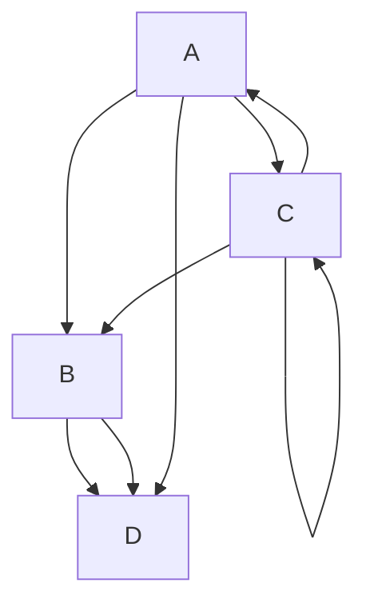

## 1. which number is greatest among three numbers
___

```c#
using System;  
public class Exercise8  
{  
    public static void Main()
{
    int num1, num2, num3;

// input data
    Console.Write("Input the 1st number :");
    num1 = Convert.ToInt32(Console.ReadLine());
    Console.Write("Input the  2nd number :");
    num2 = Convert.ToInt32(Console.ReadLine());
    Console.Write("Input the 3rd  number :");
    num3 = Convert.ToInt32(Console.ReadLine());
 
 // condition
  if (num1 > num2)
    {
        if (num1 > num3)
        {
            Console.Write("1st Number is the greatest. \n\n");
        }
        else
        {
            Console.Write("3rd Number is the greatest. \n\n");
        }
    }
    else if (num2 > num3)
        Console.Write("2nd Number is the greatest. \n\n");
    else
        Console.Write("3rd Number is the greatest. \n\n");
}
}


```

## Example



## 2. Triabgle area calculate
___

```c#
using System;
public class AreaOfTriangle
{
    public static void Main()
    {
        Console.Write("Enter the Base:");
        double Base = Convert.ToDouble(Console.ReadLine());
        Console.Write("Enter the Height:");
        double Height = Convert.ToDouble(Console.ReadLine());
        
        double Area = (Base * Height) / 2;

        Console.Write("Area of a Triangle = " + Area);
        Console.ReadKey();
    }
}

```


## 3. Swapping number
___

```c#
using System;
namespace swappin_number
{
    class swapping_number
    {
        public static void Main(string[] args)
        {
            int a = 5;
            int b = 10;
            int c = a;
            a = b;
            b = c;
            Console.WriteLine("swapping a :" + a);//swapping : 10
            Console.WriteLine("swapping b :" + b);//swapping : 5
        }
    }
}


```

## 4. Quadratic equation ax2+bx+c=0
___

```c#
using System;  
public class Exercise11  
{  
    public static void Main()
{
//   variable declaration
   int a,b,c;
   double d, x1,x2;
    Console.Write("Input the value of a : ");
    a = Convert.ToInt32(Console.ReadLine());
    Console.Write("Input the value of b : ");
    b = Convert.ToInt32(Console.ReadLine());
    Console.Write("Input the value of c : ");
    c = Convert.ToInt32(Console.ReadLine());

// quadratic law
   d=b*b-4*a*c;
   if(d==0)
   {
     Console.Write("Both roots are equal.\n");
     x1=-b/(2.0*a);
     x2=x1;
     Console.Write("First  Root1= {0}\n",x1);
     Console.Write("Second Root2= {0}\n",x2);
   }
   else if(d>0)
	{
	   Console.Write("Both roots are real and diff-2\n");

	   x1=(-b+Math.Sqrt(d))/(2*a);
	   x2=(-b-Math.Sqrt(d))/(2*a);

	   Console.Write("First  Root1= {0}\n",x1);
	   Console.Write("Second Root2= {0}\n",x2);
	}
	else
	    Console.Write("Root are imeainary;");
}
}


```


## 5. Prime number 1 to 50
___

```c#
using System;  
public class Exercise34 
{  
    public static void Main()
{
    //variable declaration
    int num, i, ctr, first_num, second_num;
	
	  	
    //Input prime number
    Console.Write("Input 1st number: ");
    first_num = Convert.ToInt32(Console.ReadLine()); 	
    Console.Write("Input 2nd number: ");
    second_num = Convert.ToInt32(Console.ReadLine()); 	
    Console.Write("Prime numbers between {0} and {1} are : \n",first_num,second_num);
  
  
    //Condition & Loop
    for(num = first_num; num <= second_num; num++)
       {
         ctr = 0;

         for(i = 2; i <= num/2; i++)
            {
             if(num%i == 0){
                 ctr++;
                 break;
             }
        }
        
         if(ctr==0 && num!= 1)
             Console.Write("{0} ",num);
    }
    Console.Write("\n"); 
  } 
} 

```

## 6. Fibonacci series
___

```c#
using System;  
  public class FibonacciExample  
   {  
     public static void Main(string[] args)  
      {  
         int n1=0,n2=1,n3,i,number;    
         Console.Write("Enter the number of elements: ");    
         number = int.Parse(Console.ReadLine());  
         Console.Write(n1+" "+n2+" "); //printing 0 and 1    
        
        
         for(i=2; i<number; ++i) //loop starts from 2 because 0 and 1 are already printed    
         {    
          n3=n1+n2;    
          Console.Write(n3+" ");    
          n1=n2;    
          n2=n3;    
         }    
      }  
   } 


```


## 7. Factorial number
___

```c#
// C# program to find factorial
// of given number
using System;
 
class Test {
    // method to find factorial
    // of given number
    static int factorial(int n)
    {
        if (n == 0)
            return 1;
 
        return n * factorial(n - 1);
    }
 
    // Driver method
    public static void Main()
    {
        int num = 5;
        Console.WriteLine("Factorial of "
                          + num + " is " + factorial(5));
    }
}

```


## 8. Check any prime number
___

```c#
using System;  
  public class PrimeNumberExample  
   {  
     public static void Main(string[] args)  
      {  
          int n, i, m=0, flag=0;    
          Console.Write("Enter the Number: ");    
          n = int.Parse(Console.ReadLine());  
          m=n/2;    
          for(i = 2; i <= m; i++)    
          {    
           if(n % i == 0)    
            {    
             Console.Write("Number is not Prime.");    
             flag=1;    
             break;    
            }    
          }    
          if (flag==0)    
           Console.Write("Number is Prime.");       
     }  
   }  

```


## 9. Character,  number, special character
___

```c#
using System;
namespace characters_specialChar_number
{
    class characters_specialChar_number
    {
        public static void Main(string[] args)
        {
            string str;
            int alphabet, number, specialChar, i, l;
            alphabet = number = specialChar = i = 0;
            Console.Write("Write Somethig : ");
            str = Console.ReadLine();
            l = str.Length;
            
            
            while(i < l)
            {
                if((str[i]>='a' && str[i]<='z') || (str[i]>='A' && str[i]<='Z'))
                {
                    alphabet++;
                }
                else if(str[i]>='0' && str[i]<='9')
                {
                    number++;
                }
                else
                {
                    specialChar++;
                }
                i++;
            }
            Console.WriteLine("Aphabet is = {0}\n ", alphabet);
            Console.WriteLine("Number is = {0}\n" , number);
            Console.WriteLine("Special Character is = {0}\n", specialChar);
        }
    }
}

```


## 10. 2+4+6+...n find sum series
___

```c#
using System;

class Program {
    static void Main(string[] args) {
        int n = 10; // change this to the desired value of n
        int result = 0;
        for (int i = 2; i <= n; i += 2) {
            result += i;
        }
        Console.WriteLine("Summation series: 2+4+6+...+" + n + " = " + result);
    }
}


```

## 11. 1+3+5+...n find sum series
___

```c#
using System;

class Program {
    static void Main(string[] args) {
        int n = 10; // change this to the desired value of n
        int result = 0;
        for (int i = 1; i <= n; i += 2) {
            result += i;
        }
        Console.WriteLine("Summation series: 1+3+5+...+" + n + " = " + result);
    }
}


```


## 12. 1+2+3+4+...n find sum series
___

```c#
using System;

class Program {
    static void Main(string[] args) {
        int n = 10; // change this to the desired value of n
        int result = 0;
        for (int i = 1; i <= n; i++) {
            result += i;
        }
        Console.WriteLine("Summation series: 1+2+3+4+...+" + n + " = " + result);
    }
}


```


## 13. 1(3)+2(3)+3(3)+...n find sum series
___

```c#

using System;

class Program {
    static void Main(string[] args) {
        int n = 3; // change this to the desired value of n
        int result = 0;
        for (int i = 1; i <= n; i++) {
            result += i * i * i;
        }
        Console.WriteLine("Summation series: 1^3 + 2^3 + 3^3 + ... + " + n + "^3 = " + result);
    }
}


```


## 14. 1(2)+2(2)+3(2)+...n find sum series
___

```c#

using System;

class Program {
    static void Main(string[] args) {
        int n = 3; // change this to the desired value of n
        int result = 0;
        for (int i = 1; i <= n; i++) {
            result += i * i;
        }
        Console.WriteLine("Summation series: 1^2 + 2^2 + 3^2 + ... + " + n + "^2 = " + result);
    }
}

```


